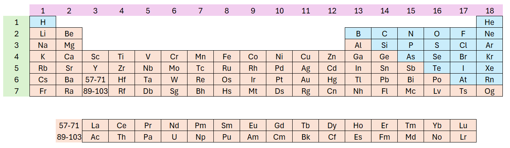

## Grundstoffer der typisk optager eller afgiver elektroner  
Vi har tidligere betragtet periodesystemet. Se igen på det her. En simpel version af periodesystemet er synlig her på siden. 

### Besvar tre spørgsmål:

1. Vi taler om to forskellige typer af grundstoffer i periodesystemet, som her er markeret med to forskellige farver. Hvilke to typer er det?
1. Hvilken type af grundstofferne er det, der er nævnt til typisk at optage elektroner?
1. Hvilken type af grundstofferne er det, der er nævnt til typisk at afgive elektroner?