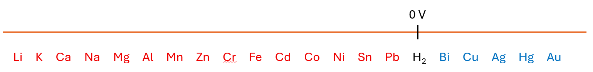

# Redoxreaktion med to metaller - den elektrokemiske spændingsrække
Der er også muligt for to metaller at indgår i en redoxreaktion. Her er det ene metal på fast form. Det kan fx være en zincstang, $\ce{Zn(s)}$. Det andet metal er en metalion og er opløst i vand. Det kan fx være $\ce{Cu^{2+}(aq)}$. 
Det er umiddelbart måske lidt underligt, at en reaktion mellem to metaller kan finde sted, for vi har talt om at metaller typisk afgiver elektroner. En redoxreaktion kan naturligvis ikke gennemføres, hvis der ikke er et stof, som kan optage elektroner. Det er dog også tilfældet, når det ene metal er på ionform. 
Det gælder, at nogle metaller er mere villige til at afgive elektroner end andre. Derfor får et metali disse reaktioner rollen som elektronafgiver og det andet metal rollen som elektronoptager.
Nu er spørgsmålet så blot: 
- Hvilke metaller er mest villige til at afgive elektroner, og hvilke metaller er mindst villige til at afgive elektroner?

Til det formål ser vi først på en grafisk fremstilling af det, som er kendt som spændingsrækken. Den er vigtig inden for det felt, som kendes som elektrokemi.

- Spændingsrækken viser metaller opstillet således, at man til venstre har de metaller, der er mest villige til at afgive elektroner. 
- Til venstre ser man derfor de metaller, der er mest villige til at blive oxideret.
- Metallerne til venstre kaldes for **uædle** metaller.
- Metallerne til højre er mindre villige til at afgive  elektroner - og mere villige til at optage elektroner
- Metallerne til højre kaldes for de **ædle** metaller.
- Spændingsrækken er meget vigtig, når man skal fremstille batterier - og dermed giver ordet spænding også mening.

 Her er et eksempel på en repræsentation af spændingsrækken. Man kan også se en figur i bogen.

 

Med metallerne vist her er lithium det metal, der er mest villigt til at afgive elektroner, mens guld er det metal, der er mindst villigt til at afgive elektroner. Vi kender også guld som et ædelt metal.
Læg mærke til, at dihydrogen er inkluderet i spændingsrækken, og at der ved dihydrogen er markeret 0 V, som er 0 volt. Lad os se lidt nærmere på, hvorfor dette er vigtigt i forståelsen af spændingsrækken.

### Grundstofferne i spændingsrækken og redoxreaktioner
Vi kan for alle grundstofferne i spændingsrækken opskrive  reaktionsskemaer som ligevægte, hvor reaktionen mod højre er oxidation af grundstoffer . Her er tre eksempler.

$$\ce{K+ (aq) + e- <=> K (s)}$$

$$\ce{H+(aq) + e-  <=> 1/2H2(g)}$$

$$\ce{Cu^{2+} (aq) +2e- <=> Cu (s)}$$

#### Redoxpotentialer for udvalgte metaller/metalioner og dihydrogen

Når redoxparrene betragtes kan man bestemme et såkaldt <i>reduktionspotentiale</i>. I tabellen nedenfor er det vist eksempler på det. 

  <table border="1" cellspacing="0" style="border-collapse: collapse;">
    <tr>
      <th style="background-color:#f0f0f0; font-weight: bold; font-size: 1.1em; padding: 6px 10px;">Redoxpar</th>
      <th style="background-color:#f0f0f0; font-weight: bold; font-size: 1.1em; padding: 6px 10px;">Reduktionspotentiale</th>
    </tr>
    <tr><td style="padding: 4px 8px;">$$\ce{Li/Li^+}$$</td><td style="text-align: center; padding: 4px 8px;">-3.040</td></tr>
    <tr><td style="padding: 4px 8px;">$$\ce{K/K^+}$$</td><td style="text-align: center; padding: 4px 8px;">-2.924</td></tr>
    <tr><td style="padding: 4px 8px;">$$\ce{Ca/Ca^2+}$$</td><td style="text-align: center; padding: 4px 8px;">-2.868</td></tr>
    <tr><td style="padding: 4px 8px;">$$\ce{Na/Na^+}$$</td><td style="text-align: center; padding: 4px 8px;">-2.713</td></tr>
    <tr><td style="padding: 4px 8px;">$$\ce{Mg/Mg^2+}$$</td><td style="text-align: center; padding: 4px 8px;">-2.372</td></tr>
    <tr><td style="padding: 4px 8px;">$$\ce{Al/Al^3+}$$</td><td style="text-align: center; padding: 4px 8px;">-1.662</td></tr>
    <tr><td style="padding: 4px 8px;">$$\ce{Mn/Mn^2+}$$</td><td style="text-align: center; padding: 4px 8px;">-1.185</td></tr>
    <tr><td style="padding: 4px 8px;">$$\ce{Zn/Zn^2+}$$</td><td style="text-align: center; padding: 4px 8px;">-0.762</td></tr>
    <tr><td style="padding: 4px 8px;">$$\ce{Cr/Cr^3+}$$</td><td style="text-align: center; padding: 4px 8px;">-0.744</td></tr>
    <tr><td style="padding: 4px 8px;">$$\ce{Fe/Fe^2+}$$</td><td style="text-align: center; padding: 4px 8px;">-0.447</td></tr>
  </table>

  <table border="1" cellspacing="0" style="border-collapse: collapse;">
    <tr>
      <th style="background-color:#f0f0f0; font-weight: bold; font-size: 1.1em; padding: 6px 10px;">Redoxpar</th>
      <th style="background-color:#f0f0f0; font-weight: bold; font-size: 1.1em; padding: 6px 10px;">Reduktionspotentiale</th>
    </tr>
    <tr><td style="padding: 4px 8px;">$$\ce{Cd/Cd^2+}$$</td><td style="text-align: center; padding: 4px 8px;">-0.403</td></tr>
    <tr><td style="padding: 4px 8px;">$$\ce{Co/Co^2+}$$</td><td style="text-align: center; padding: 4px 8px;">-0.277</td></tr>
    <tr><td style="padding: 4px 8px;">$$\ce{Ni/Ni^2+}$$</td><td style="text-align: center; padding: 4px 8px;">-0.257</td></tr>
    <tr><td style="padding: 4px 8px;">$$\ce{Sn/Sn^2+}$$</td><td style="text-align: center; padding: 4px 8px;">-0.137</td></tr>
    <tr><td style="padding: 4px 8px;">$$\ce{Pb/Pb^2+}$$</td><td style="text-align: center; padding: 4px 8px;">-0.126</td></tr>
    <tr><td style="padding: 4px 8px;">$$\ce{H2/H^+}$$</td><td style="text-align: center; padding: 4px 8px;">0.000</td></tr>
    <tr><td style="padding: 4px 8px;">$$\ce{Bi/Bi^3+}$$</td><td style="text-align: center; padding: 4px 8px;">+0.317</td></tr>
    <tr><td style="padding: 4px 8px;">$$\ce{Cu/Cu^2+}$$</td><td style="text-align: center; padding: 4px 8px;">+0.340</td></tr>
    <tr><td style="padding: 4px 8px;">$$\ce{Ag/Ag^+}$$</td><td style="text-align: center; padding: 4px 8px;">+0.800</td></tr>
    <tr><td style="padding: 4px 8px;">$$\ce{Au/Au+}$$</td><td style="text-align: center; padding: 4px 8px;">+1.692</td></tr>
  </table>

Tallene i den højre kolonne fortæller os følgende:
- Des lavere tallet er, des nemmere oxideres stoffet. Det betyder med andre ord, at stoffet er villigt til at afgive elektroner.
- Des højere tallet er, des nemmere reduceres stoffet. Det betyder med andre ord, at stoffet er villigt til at optage elektroner.  
- Noter at potentialet for $\ce{H2}$ er 0 V. Dihydrogen benyttes som reference, så de andre stoffer måles i forhold til dihydrogen.

### Brug af spændingsrækken til at forudsige, om en reaktion finder sted.

Lad os vise spændingsrækken igen på den simple form.

  

Når to metaller reagerer med hinanden er det ene metal på ionform og det er opløst i vand. Det andet metal er på fast form. Reaktionen kan fx se således ud:

$$\ce{Mg(s) + Cu^{2+}(aq) ->Mg^{2+}(aq) +Cu(s)}$$

Ovenstående reaktion <strong>finder sted</strong> spontant, da Mg står <mark>længere til venstre</mark> i spændingsrækken end Cu. Mg er villig til at afgive elektroner til $\ce{Cu^{2+}}$, og kobberionen optager elektronerne og danner fast kobber.

Nedenstående reaktion

$$\ce{Mg^{2+}(aq) + Cu(s) ->Mg(s) +Cu^{2+}(aq)}$$

finder ikke sted spontant. Cu står <mark>længere til højre</mark> i spændingsrækken end Mg, og derfor afgiver kobber ikke spontant elektroner til magnesiumionen.

### Hydrogen og syre i spændingsrækken.

Det kan forekomme specielt, at $\ce{H2}$ optræder i spændingsrækken. Læg også mærke til at redoxparret er $\ce{H2/H+}$.

- $\ce{H+}$ viser os, at der er tale om en syre.
- Vi nøjes her med at skrive $\ce{H+}$ i stedet for $\ce{H3O+}$.
- Læg mærke til at $\ce{H2}$ er en gas ved standardbetingelserne.

Vi kommer til at betragte reaktioner med syrer, men spændingsrækken viser standard <strong>reduktionsreaktioner</strong>. Det var det, som vi så på tidligere, og som gentages her.

$$\ce{K+ (aq) + e- <=> K (s)}$$

$$\ce{H+(aq) + e-  <=> 1/2H2(g)}$$

$$\ce{Cu^{2+} (aq) +2e- <=> Cu (s)}$$

Det er altså $\ce{H2}$ der står i spændingsrækken.

#### Reaktion med syre eller ej?

Vil denne reaktion finde sted?

$$\ce{Zn(s) + 2H+(aq) ->}$$

Vi ser på spændingsrækken. Zn står til venstre for $\ce{H2}$, så derfor afgiver Zn villigt elektroner til $\ce{H+}$. Reaktionen bliver:

$$\ce{Zn(s) + 2H+(aq) -> Zn^{2+}(aq)+ H2(g)}$$

Vil denne reaktion finde sted?

$$\ce{Au(s) + 2H+(aq) ->}$$

<mark>Nej.</mark> Au står til højre for $\ce{H2}$, så reaktionen finder ikke sted spontant.

