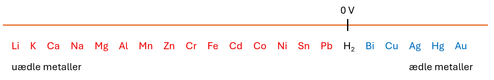

# Redoxreaktion med to metaller - spændingsrækken
Der er også muligt for to metaller at indgår i en redoxreaktion. Det er umiddelbart måske lidt underligt, for vi har talt om at metaller typisk afgiver elektroner. En redoxreaktion kan naturligvis ikke gennemføres, hvis der ikke er et stof, som kan optage elektroner. 
Det er imidlertid således, at nogle metaller er mere villige til at afgive elektroner end andre. Derfor får et metal rollen som elektronafgiver og det andet metal rollen som elektronoptager.
Nu er spørgsmålet så blot: 
- Hvilke metaller er mest villige til at afgive elektroner, og hvilke metaller er mindst villige til at afgive elektroner?

Til det formål ser vi først på en grafisk fremstilling af det, som er kendt som spændingsrækken. 

- Spændingsrækken viser metaller opstillet således, at man til venstre har de metaller, der er mest villige til at afgive elektroner. 
- Til venstre ser man derfor de metaller, der er mest villige til at blive oxideret.
- Metallerne til venstre kaldes for uædle metaller.
- Metallerne til højre holder sig mest på metalform, og de kalder for de ædle metaller.
- Spændingsrækken er meget vigtig, når man skal fremstille batterier - og dermed giver ordet spænding også mening.

 Her er et eksempel på en repræsenation af spændingsrækken. Man kan også se en figur i bogen.

 

Med metallerne vist her er lithium det metal, der er mest villigt til at afgive elektroner, mens guld er det metal, der er mindst villigt til at afgive elektroner. Vi kender også guld som et ædelt metal.
Læg mærke til, at dihydrogen er inkluderet i spændingsrækken, og at der ved dihydrogen er markeret 0 V, som er 0 volt. Lad os se lidt nærmere på, hvorfor dette er vigtigt i forståelsen af spændingsrækken.

### Grundstofferne i spændingsrækken og redoxreaktioner
Vi kan for alle grundstofferne i spændingsrækken opskrive et reaktionsskema, hvor stoffet oxideres. Her er tre eksempler.

$$\ce{K -> K+ + e-}$$

$$\ce{H_2 -> 2H+ + 2e-}$$

$$\ce{Cu -> Cu^{2+} +2e-}$$

#### Normalpotentialer for udvalgte metaller/metalioner og dihydrogen

  <table border="1" cellspacing="0" cellpadding="6" style="border-collapse: collapse;">
    <tr>
      <th>Metal/ion</th>
      <th>Spænding (V)</th>
    </tr>
    <tr><td>$$\ce{Li/Li^+}$$</td><td style="text-align: center;">-3.040</td></tr>
    <tr><td>$$\ce{K/K^+}$$</td><td style="text-align: center;">-2.931</td></tr>
    <tr><td>$$\ce{Ca/Ca^2+}$$</td><td style="text-align: center;">-2.868</td></tr>
    <tr><td>$$\ce{Na/Na^+}$$</td><td style="text-align: center;">-2.714</td></tr>
    <tr><td>$$\ce{Mg/Mg^2+}$$</td><td style="text-align: center;">-2.372</td></tr>
    <tr><td>$$\ce{Al/Al^3+}$$</td><td style="text-align: center;">-1.662</td></tr>
    <tr><td>$$\ce{Mn/Mn^2+}$$</td><td style="text-align: center;">-1.185</td></tr>
    <tr><td>$$\ce{Zn/Zn^2+}$$</td><td style="text-align: center;">-0.763</td></tr>
    <tr><td>$$\ce{Cr/Cr^3+}$$</td><td style="text-align: center;">-0.744</td></tr>
    <tr><td>$$\ce{Fe/Fe^2+}$$</td><td style="text-align: center;">-0.440</td></tr>
    <tr><td>$$\ce{Cd/Cd^2+}$$</td><td style="text-align: center;">-0.403</td></tr>
    <tr><td>$$\ce{Co/Co^2+}$$</td><td style="text-align: center;">-0.277</td></tr>
    <tr><td>$$\ce{Ni/Ni^2+}$$</td><td style="text-align: center;">-0.250</td></tr>
    <tr><td>$$\ce{Sn/Sn^2+}$$</td><td style="text-align: center;">-0.136</td></tr>
    <tr><td>$$\ce{Pb/Pb^2+}$$</td><td style="text-align: center;">-0.126</td></tr>
    <tr><td>$$\ce{H2/H^+}$$</td><td style="text-align: center;">0.000</td></tr>
    <tr><td>$$\ce{Bi/Bi^3+}$$</td><td style="text-align: center;">+0.317</td></tr>
    <tr><td>$$\ce{Cu/Cu^2+}$$</td><td style="text-align: center;">+0.337</td></tr>
    <tr><td>$$\ce{Ag/Ag^+}$$</td><td style="text-align: center;">+0.799</td></tr>
    <tr><td>$$\ce{Hg/Hg^2+}$$</td><td style="text-align: center;">+0.854</td></tr>
    <tr><td>$$\ce{Au/Au^3+}$$</td><td style="text-align: center;">+1.498</td></tr>
  </table>

